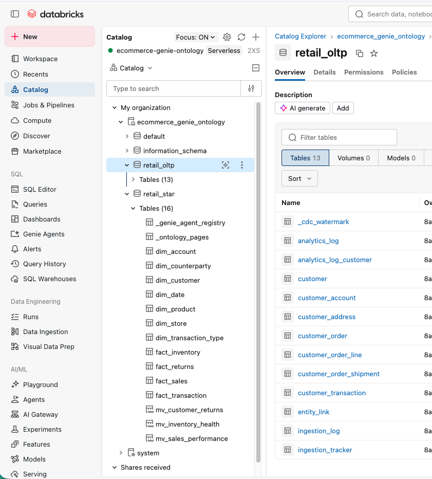
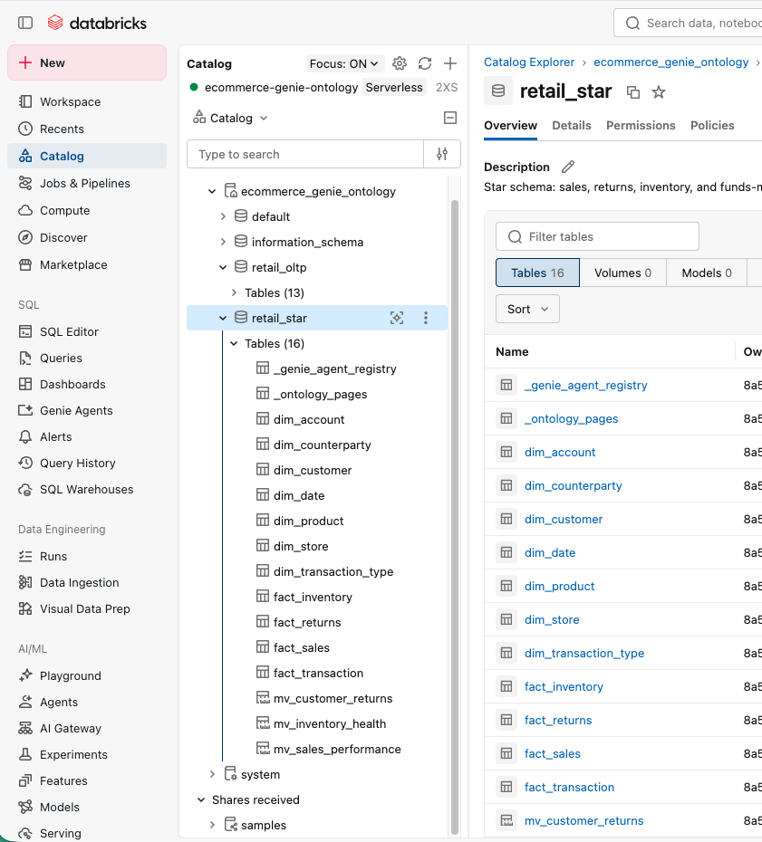
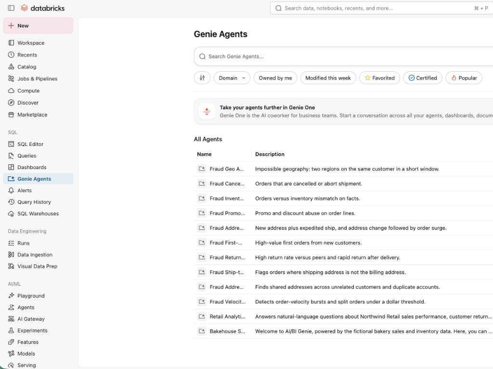
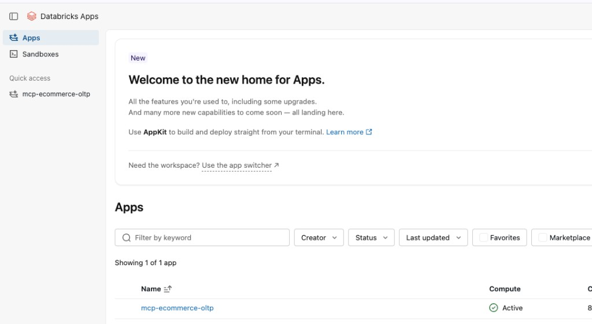
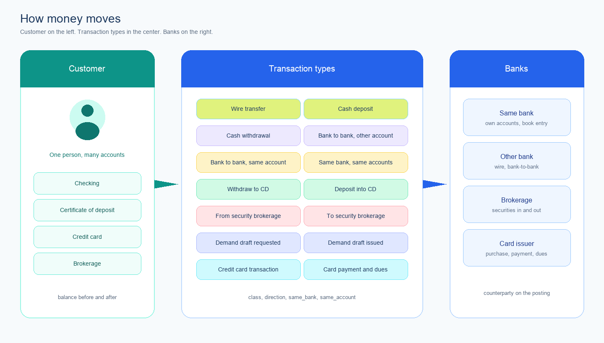
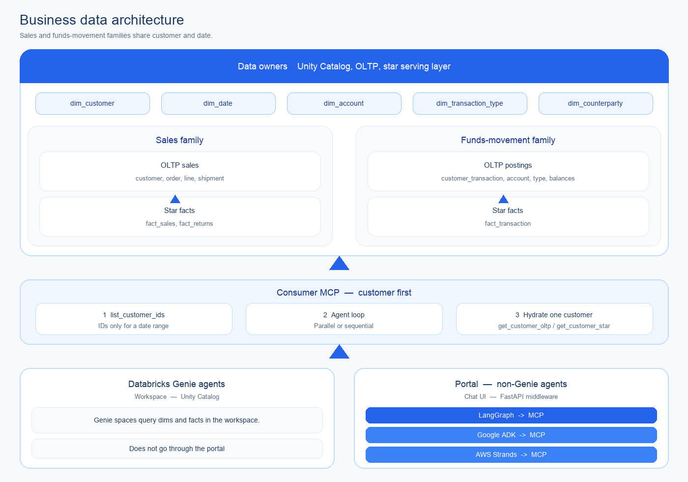
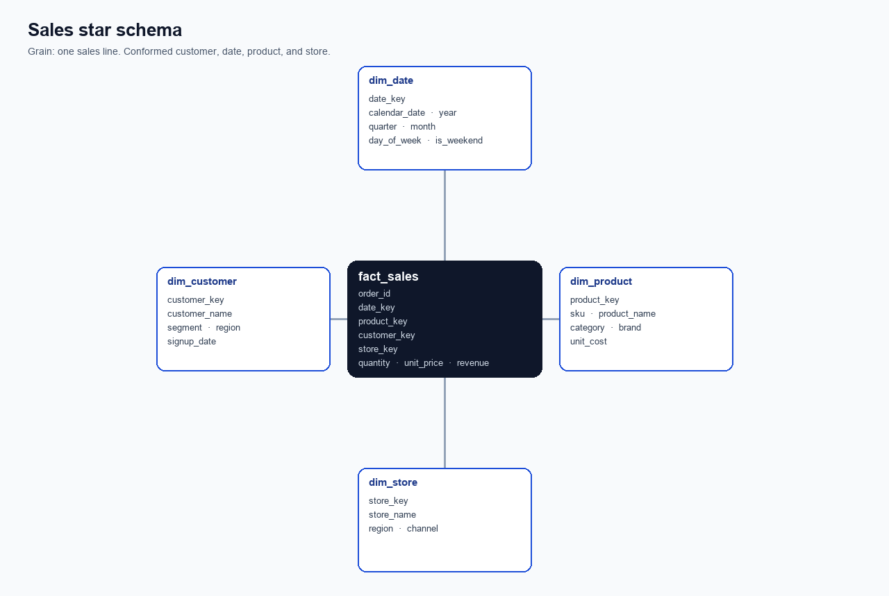
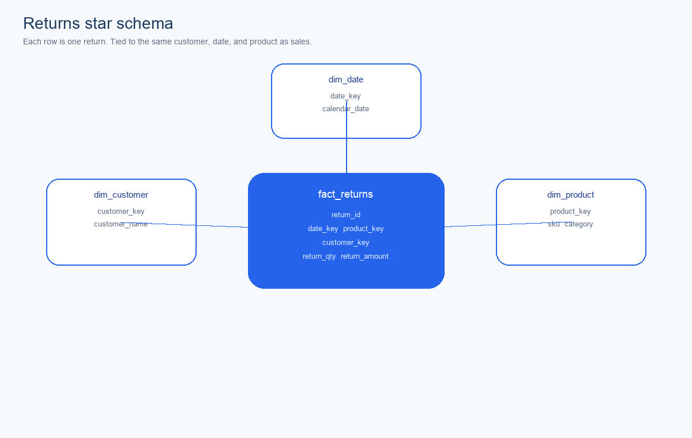
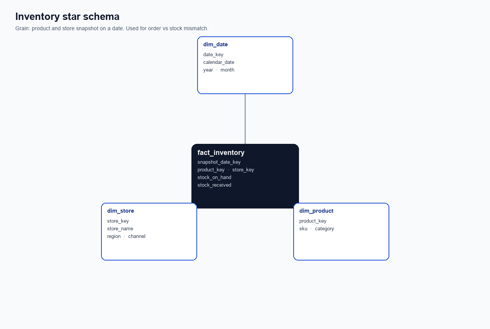
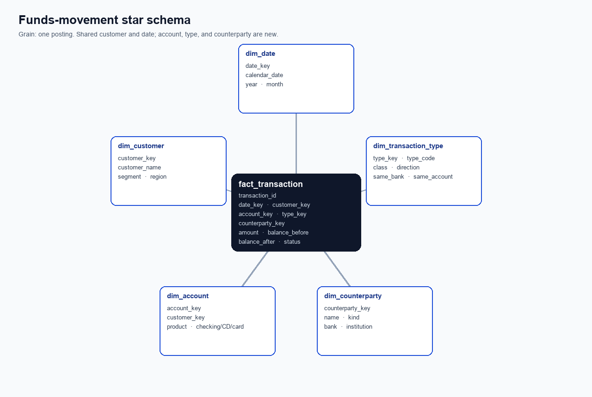

# Databricks Genie Ontology

Governed customer sales and funds-movement data: Unity Catalog, OLTP, star
schema, and fraud-ready MCP. Portal teams call **LangGraph**, **Google ADK**,
or **AWS Strands** through FastAPI. Provision, load, and tear down with GitHub
Actions — no notebook import.

All data management is currently managed in Databricks and Databricks Genie
and its AI Agents.

## Table of Contents

- [Business Context](#business-context)
  - [Customer behavior](#customer-behavior)
  - [Purpose](#purpose)
  - [Fraud Detection behavior](#fraud-detection-behavior)
  - [Customer Data Capacity Considered](#customer-data-capacity-considered)
  - [OLTP and Star Schema Models](#oltp-and-star-schema-models)
- [Business Data Architecture](#business-data-architecture)
  - [DataWarehouse](#datawarehouse)
  - [The Architecture behind MCP](#the-architecture-behind-mcp)
- [Prerequisites](#prerequisites)
- [Setup](#setup)
- [GitHub Actions (no local CLI)](#github-actions-no-local-cli)
- [Run locally (uses .env, talks to Databricks APIs)](#run-locally-uses-env-talks-to-databricks-apis)
- [Create the Databricks workspace](#create-the-databricks-workspace)
- [Create the SQL warehouse](#create-the-sql-warehouse)
- [Create the catalog, schema, and star tables](#create-the-catalog-schema-and-star-tables)
- [Drop the catalog](#drop-the-catalog)
- [HTTP interface](#http-interface)
- [How Genie Agent Works](#how-genie-agent-works)
  - [Genie Agent intro](#genie-agent-intro)
  - [Fraud Geo Agent](#fraud-geo-agent)
    - [What happened on this agent (simple)](#what-happened-on-this-agent-simple)
  - [This Genie Agent Runtime Behavior](#this-genie-agent-runtime-behavior)
  - [Do Pages come into the picture?](#do-pages-come-into-the-picture)
  - [Genie MCP tools this agent uses — and where to trace them](#genie-mcp-tools-this-agent-uses--and-where-to-trace-them)
- [MCP tools](#mcp-tools)
  - [MCP tools in Databricks Genie](#mcp-tools-in-databricks-genie)
  - [MCP tools in this codebase](#mcp-tools-in-this-codebase)
- [Fraud agents (inside `ecommerce_genie_ontology`)](#fraud-agents-inside-ecommerce_genie_ontology)
  - [Context management and graph databases](#context-management-and-graph-databases)
- [OLTP and CDC without GitHub Actions](#oltp-and-cdc-without-github-actions)
- [Register and run Databricks Jobs without GitHub Actions](#register-and-run-databricks-jobs-without-github-actions)
- [Running Agentic Fraud Analytics - Start To Finish](#running-agentic-fraud-analytics---start-to-finish)

## Running Agentic Fraud Analytics - Start To Finish

Use **Actions → Run workflow**. **Time** is the last measured GitHub Actions
job duration (19 Sep 2026 Step 100 unless noted). Look at the GitHub run
first, then the Databricks account and workspace pages.

Template URLs only — replace the `{placeholders}`:

- Account workspace: `https://accounts.cloud.databricks.com/workspaces/{WORKSPACE_ID}?account_id={ACCOUNT_ID}`
- Workspace home: `https://{WORKSPACE_HOST}`
- Catalog: `https://{WORKSPACE_HOST}/explore/data/{CATALOG}`
- Genie: `https://{WORKSPACE_HOST}/genie`
- Genie MCP (one space): `https://{WORKSPACE_HOST}/api/2.0/mcp/genie/{SPACE_ID}`
- Apps: `https://{WORKSPACE_HOST}/apps`
- Custom MCP App: `https://{WORKSPACE_HOST}/apps/mcp-ecommerce-oltp`
- Discover: `https://{WORKSPACE_HOST}/search/discover`
- This run: `https://github.com/{OWNER}/{REPO}/actions/runs/{RUN_ID}`

Fresh start: run **01 - Setup - Step 100 - Create All Together**. It chains 01 → 02 → 03 → 04 → 06 → 07. Atomic steps stay 01–10 so we can insert 11, 12, … in the middle later; 100+ stays the composite.

| S. No | GitHub workflow name | Time | What to look at | Comments |
|---|---|---|---|---|
| 0 | 01 - Setup - Step 100 - Create All Together | **16 min** | Same checks as Steps 01, 02, 03, 04, 06, 07 | Measured **15 min 51 s** (19 Sep 2026, run 35472667395). Wall clock 01+02+03+04+06+07. One **Run workflow**. Skips Step 05 and Step 08. `row_count` and `months` pass through. |
| 1 | 01 - Setup - Step 01 - Create Databricks stack | **5 min** | GitHub job green; workspace **RUNNING**; SQL warehouse up; catalog empty tables | Measured **4 min 53 s** (same Step 100). Workspace 42 s, warehouse 18 s, catalog 3 min 3 s, deploy jobs 42 s. Account page `https://accounts.cloud.databricks.com/workspaces/{WORKSPACE_ID}?account_id={ACCOUNT_ID}`. Then open `https://{WORKSPACE_HOST}`. Starts the 3-hour destroy timer. Does **not** create Genie spaces. |
| 2 | 01 - Setup - Step 02 - Create all Genie agents | **1 min** | 11 Genie spaces (Retail Analytics + 10 fraud specialists) | Measured **1 min 4 s**. Genie `https://{WORKSPACE_HOST}/genie`. Rerun this if agents fail; do not rerun Step 01. Each space MCP: `https://{WORKSPACE_HOST}/api/2.0/mcp/genie/{SPACE_ID}`. |
| 3 | 01 - Setup - Step 03 - Publish ecommerce-oltp MCP App | **4 min** | App **mcp-ecommerce-oltp** on Apps | Measured **3 min 30 s**. `https://{WORKSPACE_HOST}/apps`. MCP `{APP_URL}/mcp`. Playground / Supervisor list `mcp-*` apps. Classic Genie still uses Genie MCP only. |
| 4 | 01 - Setup - Step 04 - Publish Discover domains | **20 s** | Discover cards for Sales, Customer, Supply Chain, Finance are **Published** | Measured **20 s**. [Domain API](https://docs.databricks.com/api/domains/v1/domain) `POST/PATCH /api/discover/v1/domains`. Needs **MANAGE DISCOVERY**. Then `https://{WORKSPACE_HOST}/search/discover`. Pages SKIP until that API accepts the payload. |
| 5 | 01 - Setup - Step 05 - Invoke Retail Analytics Genie | **3 min** | Sample questions return SQL + a short answer | Measured **3 min 14 s** (not in Step 100). Confirms Genie MCP on the retail space. Optional question input. |
| 6 | 01 - Setup - Step 06 - Populate next 100000 OLTP rows | **3 min** | `ingestion_tracker` / `ingestion_log`; row counts on `customer_order` and `customer_transaction` | Measured **2 min 34 s** for 100,000 rows on a warm cluster. Catalog `https://{WORKSPACE_HOST}/explore/data/{CATALOG}`. Repeat until `caught_up`. |
| 7 | 01 - Setup - Step 07 - Populate next N months of dims and facts | **3 min** | `fact_order_event` plus STALE `fact_sales` / `fact_inventory` | Measured **3 min 10 s** for 3 months. Same catalog. Months 1–12 (default 3). Fraud reads `fact_order_event`. |
| 8 | 01 - Setup - Step 08 - Pipeline next 100000 OLTP and next N months star | **6 min** | Step 06 then Step 07 in one run | Last measured pieces: 2 min 34 s + 3 min 10 s. Use this instead of running 06 and 07 separately. |
| 9 | 02 - Fraud Agent - 01 - Fraud Velocity Agent | 3–10 min | Space **Fraud Velocity Agent** | Genie MCP for velocity bursts and split orders. |
| 10 | 02 - Fraud Agent - 02 - Fraud Address Link Agent | 3–10 min | Space **Fraud Address Link Agent** | Shared-address / duplicate-account hops. |
| 11 | 02 - Fraud Agent - 03 - Fraud Ship-to Bill-to Agent | 3–10 min | Space **Fraud Ship-to Bill-to Agent** | Ship-to ≠ bill-to. |
| 12 | 02 - Fraud Agent - 04 - Fraud Returns Agent | 3–10 min | Space **Fraud Returns Agent** | High / rapid returns. |
| 13 | 02 - Fraud Agent - 05 - Fraud First-Order Agent | 3–10 min | Space **Fraud First-Order Agent** | High-value first orders. |
| 14 | 02 - Fraud Agent - 06 - Fraud Address Surge Agent | 3–10 min | Space **Fraud Address Surge Agent** | New address + expedite / surge. |
| 15 | 02 - Fraud Agent - 07 - Fraud Promo Agent | 3–10 min | Space **Fraud Promo Agent** | Promo and discount abuse. |
| 16 | 02 - Fraud Agent - 08 - Fraud Inventory Agent | 3–10 min | Space **Fraud Inventory Agent** | Orders vs stock mismatch. |
| 17 | 02 - Fraud Agent - 09 - Fraud Cancel Agent | 3–10 min | Space **Fraud Cancel Agent** | Cancel / abort shipment. |
| 18 | 02 - Fraud Agent - 10 - Fraud Geo Agent | 3–10 min | Space **Fraud Geo Agent** | Default system prompt is the Case 15 notes. **system_prompt** overrides it. Five starter-question checkboxes ask those prompts. **additional_prompt** is comma-separated customer ids. |
| 19 | 01 - Setup - Step 09 - Destroy Databricks stack | **1 min** | Workspace gone from account console; cleanup email | Measured **1 min 7 s** (19 Sep 2026, run 35472183222). Type `DELETE`. Deletes `mcp-ecommerce-oltp`, catalog, warehouse, workspace. Cancels the 3-hour timer. Account list: `https://accounts.cloud.databricks.com/?account_id={ACCOUNT_ID}`. |

Historical generate / realtime CDC Actions are retired (`z_retired_*`). Use Step 100 for a full recreate, or Step 06 + 07 (or 08) for data only.

### Screenshots

1. Catalog — `docs/images/catalog-explorer.png`
2. Catalog `retail_oltp` after Step 01 — 13 source tables (`analytics_log`, customers, orders, postings, ingest).
2b. Catalog `retail_star` after Step 01 — dims, facts, metric views.
3. Genie Agents after Step 02 — Retail Analytics plus the ten fraud specialists.
4. Apps after Step 03 — **mcp-ecommerce-oltp** Active on `/apps-v2`.









## Business Context

### Customer behavior

Customer behavior is how a person buys, pays, ships, and moves money over
time: orders and lines, the addresses they use, channel, status, and — once
funds movement is in scope — wires, cash, book transfers, CDs, brokerage,
demand drafts, and cards. Most of that activity is legitimate. What matters is
the baseline per customer: typical amount, velocity, counterparties, and
whether a new address or a sudden outflow sits outside changing transaction
behaviors.

### Purpose

The purpose of this context is fraud detection: pick out abnormal behaviors
and rare fraud cases in real time, while keeping false alarms down. Fixed
thresholds and rule-based checks miss identity theft and automated attacks,
and they raise false-positives when fraudulent transactions are extremely rare
compared with legitimate ones. Amount, sudden loss of balance, and type of
movement are the high-ranking signals; agents should use them for risk
analysis without dumping ten years of rows into a model.

### Fraud Detection behavior

- Fraud judgment is the **LLM fraud agent**, not PySpark.
- Each specialist has its own **system prompt** (amount vs baseline, sudden drain, transaction type, shared-address network, velocity, changing behavior, rare event, explain the why).
- The agent writes **one outcome per customer**, not one verdict for a list.
- A customer list is only for **paging** the work. Do not ask the model to judge thousands of IDs in one shot.
- Outcome values: `fraud_found` or `not_found`.
- Persist on `analytics_log_customer`: `analytics_outcome` plus `analytics_log_info` (JSON: the why — amount, velocity, address, type).
- Session table `analytics_log`: requesting user, customer count, date range, requested datetime, analytics start/end, status `In Progress` or `Completed`.
- `initiate_fraud_analytics(from_date, to_date)` finds customer IDs **on the server**. It does not dump IDs into the LLM.
- That call creates `analytics_log` and one `analytics_log_customer` row per customer, with dim/fact **counts** for the same window.
- PySpark / SQL only **prepare**: customers in range, counts, optional evidence pack (named case, max 50 rows) as **signals**.
- PySpark does **not** set `fraud_found`. Spark `HAVING` / dollar thresholds are a rule engine — they miss changing behavior and raise false positives.
- MCP never returns 300,000 postings or 15 million orders. Hydrate **one customer** at a time (max 50 evidence rows).
- Agents stay **customer-scoped**. Loop sequential or parallel with a small concurrency cap.
- Databricks **Genie** specialists run in the workspace on the same warehouse.
- Portal agents (**LangGraph**, **Google ADK**, **AWS Strands**) call MCP through FastAPI — not raw tables.
- Same customer and date explain both a velocity flag and a wire-outflow flag.
- Sales fraud and funds-movement fraud share only `dim_customer` and `dim_date`.
- Network hops use `entity_link` (`has_address`, `shared_address`). No graph database for these cases.
- Generate / ETL / next-100k / next-N-months jobs **load data**. They do not classify fraud.
- `close_analytics` sets status `Completed` when the agent says the run is done.

### Customer Data Capacity Considered

Capacity is planned from **18 September 2016** through **18 September 2026**
(ten years ending 18 September 2026). Agents never load this volume; they
hydrate one customer at a time.

| Item | Planned | Notes |
|---|---|---|
| Customers | 100,000 | One person is one customer |
| Accounts per customer | 4 | Checking, certificate of deposit, credit card, brokerage |
| Transactions per customer per year | 30,000 | Sales lines and funds-movement postings in that year |
| Years of history | 10 | End date 18 September 2026; start 18 September 2016 |
| Transactions per customer | 300,000 | 30,000 × 10 years |
| Postings in the warehouse | about 30 billion | 100,000 × 300,000 — design ceiling, not a generate job |

Create / Generate Historical never writes 30 billion rows. That load would run
for days on a large warehouse and blow the 3-hour stack window. Default
generate is **200 customers**, **3 years**, **500 postings per customer per
year** (about 300,000 postings) plus sales orders. Orders are also capped at
20 million rows per run.

### OLTP and Star Schema Models

Sales and funds movement live in OLTP (`customer`, `customer_address`,
`customer_account`, `customer_order`, `customer_order_line`,
`customer_order_shipment`, `customer_transaction`, `ingestion_tracker`,
`ingestion_log`, `analytics_log`, `analytics_log_customer`) plus conformed dimensions
and facts (`dim_account`, `dim_transaction_type`, `dim_counterparty`,
`fact_transaction` with the sales stars). Design volume is the capacity above.
Agents are **customer-scoped**: `initiate_fraud_analytics` keeps IDs on the
server; the agent pages, hydrates **one customer**, and writes the outcome.
Databricks **Genie** agents run in the workspace. **Non-Genie** agents
(LangGraph, Google ADK, AWS Strands) come through the portal via FastAPI and
MCP. The LangGraph and Google ADK packages are conformance clients so the MCP
tools stay honest.

## Business Data Architecture

### DataWarehouse

A data warehouse turns ten years of customer activity into a place agents and
people can ask the same question and get the same answer. Facts hold the
numbers. Each fact row is one event (one sale line, one return, one money
movement). Dimensions hold the who, when, what, and where. That is what makes
amount, velocity, segment, and type comparable across 100,000 customers
without each team rewriting joins on raw OLTP.

### The Architecture behind MCP

The architecture behind MCP is what makes agentic AI fraud detection safe at
this volume. Other teams build **functional agents** — amount vs baseline,
sudden drain, type of movement, shared-address network, changing behavior,
rare events. MCP does not scan 300,000 postings per customer. It answers
those questions for one customer at a time from star facts (baselines, peers,
type mix) or OLTP (the supporting orders and postings). Genie agents and
portal agents call the same warehouse, so a velocity flag and a wire-outflow
flag can be explained from the same customer and date.

Sales fraud and funds-movement fraud share `dim_customer` and `dim_date` only.
Do not hang wire transfers or card dues off `customer_order` / `fact_sales`.
Add a second fact table: one row per **posting** (`customer_transaction` /
`fact_transaction`) with account, type, counterparty, amount, and balance
before/after.





| Fraud idea | Functional agent |
|---|---|
| Amount + sudden origin-balance drain | Amount vs baseline — spend far above this customer's recent median; sudden drain |
| Transaction type as a signal | Transaction-type — wire, cash, card, cancel, expedite, promo |
| Graph / network features | Shared-address network — hops on `entity_link` |
| Behavioral vs transactional vs network | Velocity, returns, geo, and first-order specialists |
| Adaptive / changing fraud | Changing-behavior — realtime CDC windows, not a static snapshot |
| Rare events + fewer false positives | Rare-event — peer baselines, not a blanket dollar threshold |
| Feature importance / explainability | Explain the why — amount, velocity, address; not a black box |

**Order-event star (current, fraud)** — each row is one `customer_order` with hour-level `order_ts`, billing/shipping `dim_address`, and `dim_region`. Use this for velocity, ship-to≠bill-to, and Case 15 impossible geo (`mv_order_event`).

**Sales star (STALE)** — each row is one sales line (one product on one order). Kept for Retail Analytics merchandising history only. No hour, no shipping region. Do not use for fraud.



**Returns star** — each row is one return, tied to the same customer, date, and product as sales.



**Inventory star (STALE)** — monthly product/store snapshot. Kept so `mv_inventory_health` still answers stock questions. Not a customer-fraud grain. Case 11 is the only fraud agent that may still join it.



**Funds-movement star** — each row is one money movement. Customer and date match sales; account, type, and counterparty are new.



**MCP contract (customer first)**

- `initiate_fraud_analytics(from_date, to_date)` — server finds IDs; writes `analytics_log` + `analytics_log_customer`
- Agent pages customers; hydrates **one** customer (counts + max 50 evidence rows)
- `record_customer_outcome` — `fraud_found` / `not_found` + JSON why
- `close_analytics` — status `Completed`
- Genie in the workspace; LangGraph / Google ADK / AWS Strands via FastAPI → MCP, not raw tables

**Dims (conformed)**

| Dim | Why |
|---|---|
| `dim_region` | Home / billing / shipping geography for Case 15 |
| `dim_address` | Ship-to vs bill-to and far-region (`*-AGEO`) seed |
| `dim_transaction_type` | Type signal for funds-movement agents |
| `dim_account` | Same vs other account; product (checking / CD / card / brokerage) |
| `dim_counterparty` | Other bank, other person, brokerage |
| `dim_date` | Already present |

Do not add `dim_wire`, `dim_cash`, or `dim_credit_card`. Those are rows in
`dim_transaction_type`.

**`dim_transaction_type`**

| type_code | class | direction | same_bank | same_account |
|---|---|---|---|---|
| wire_transfer | transfer | out | no | no |
| cash_deposit | cash | in | yes | yes |
| cash_withdrawal | cash | out | yes | yes |
| bank_transfer_other | transfer | out | no | no |
| bank_transfer_same_acct | transfer | book | yes | yes |
| intra_bank_same_accts | transfer | book | yes | no |
| cd_withdraw | term | out | yes | no |
| cd_deposit | term | in | yes | no |
| brokerage_in | securities | in | no | no |
| brokerage_out | securities | out | no | no |
| demand_draft_request | instrument | out | yes | no |
| demand_draft_issue | instrument | out | yes | no |
| card_purchase | card | out | no | no |
| card_payment | card | in | yes | no |
| card_due | card | obligation | yes | no |

OLTP posting row: `transaction_id`, `customer_id`, `account_id`,
`counterparty_id`, `type_code`, `txn_ts`, `amount`, `balance_before`,
`balance_after`, `status`. Partition facts by date and cluster on
`customer_id` / `account_id`. Refresh `fact_transaction` incrementally; do not
overwrite 10 years on every run.

Each of `api`, `workflows`, and `adapter_databricks` has an `ObjectsFactory`
that looks up named components and caches singleton instances.

```text
src/ecommerce_genie_ontology/
  api/                                 # FastAPI + CliApp
    objects_factory.py                 # ApiObjectsFactory
  workflows/
    objects_factory.py                 # WorkflowsObjectsFactory
    orchestrator.py                    # WorkflowRunner
    provision|create_agents|invoke_agents|cleanup/
      workflow.py
      workspace_facade/{interface,impl}.py
      tasks/
  adapter_databricks/
    objects_factory.py                 # AdapterDatabricksObjectsFactory
    daos/                              # SDK / REST
    facades/                           # SqlFacade, GenieFacade, GovernanceFacade, JobsFacade
  common/
    interfaces/                        # Protocols used for DI
    dtos/ constants/ utils/
```

| Workflow | Job name | Tasks |
|---|---|---|
| **provision** | `ecommerce-genie-ontology-provision` | `00_config` → `01_create_catalog_schema_tables` → `02_create_metric_views` → `04_apply_certification_and_domains` → `05_create_pages` |
| **create_agents** | `ecommerce-genie-ontology-create-agents` | `03_create_genie_agent` |
| **invoke_agents** | `ecommerce-genie-ontology-invoke-agents` | one task per sample question |
| **cleanup** | `ecommerce-genie-ontology-cleanup` | `06_cleanup_delete_all_assets` |
| **generate_historical** | `ecommerce-genie-ontology-generate-historical` | PySpark OLTP history (`customer`, `customer_address`, `customer_order`, `customer_order_line`, `customer_order_shipment`, `entity_link`) |
| **generate_realtime** | `ecommerce-genie-ontology-generate-realtime` | Append 100–10,000 new OLTP orders for CDC |
| **etl_historical** | `ecommerce-genie-ontology-etl-historical` | Overwrite star-schema dims/facts from OLTP |
| **etl_cdc** | `ecommerce-genie-ontology-etl-cdc` | Apply Delta change feed into `fact_sales` |
| **generate_next_oltp** | `ecommerce-genie-ontology-generate-next-oltp` | Append next 100,000 OLTP rows plus `entity_link`; update `ingestion_tracker` / `ingestion_log` |
| **etl_next_months** | `ecommerce-genie-ontology-etl-next-months` | Append `fact_sales` / `fact_returns` / `fact_inventory` / `fact_transaction` for the next 1–12 months |

Default generate is **200 customers**, **3 addresses**, **4 accounts**, **25,000 orders per customer per year**, **500 postings per customer per year**, **3 years** ending this month (about 15 million orders and 300,000 postings). That is per year, not per day. Dims/facts are rebuilt from those OLTP tables so they match. Do not set Generate to 100,000 × 30,000 × 10 — that is the design ceiling, not a GitHub Action.

## Prerequisites

- A Databricks workspace with Unity Catalog and a SQL warehouse
- Permission to create a catalog/schema, metric views, and Genie agents
- [`uv`](https://docs.astral.sh/uv/) (this project does not use pip)

## Setup

```bash
cp .env.example .env
```

Fill in at least:

```dotenv
DATABRICKS_HOST=https://your-workspace.cloud.databricks.com
DATABRICKS_TOKEN=dapiXXXXXXXX
```

`DATABRICKS_WAREHOUSE_ID` is optional. Catalog provision looks up warehouse `ecommerce-genie-ontology` by name. Genie uses the same host/token unless you set `GENIE_HOST` / `GENIE_TOKEN`.

```bash
uv sync
```

## GitHub Actions (no local CLI)

Use **Actions → Run workflow**. Create starts a 3-hour timer; a later Create cancels the previous timer. Destroy can be run by hand any time before that. Pipeline workflows are also **manual** (`workflow_dispatch` only).

**01 - Setup** — 01–99 are atomic (rerun one, or insert a new number in the middle). 100+ is a composite.

1. **01 - Setup - Step 01 - Create Databricks stack** — workspace, SQL warehouse, catalog, deploy jobs
2. **01 - Setup - Step 02 - Create all Genie agents** — Retail Analytics + 10 fraud specialists
3. **01 - Setup - Step 03 - Publish ecommerce-oltp MCP App** — Databricks App `mcp-ecommerce-oltp` for LangGraph / ADK / Playground
4. **01 - Setup - Step 04 - Publish Discover domains** — Sales, Customer, Supply Chain, Finance via `/api/discover/v1/domains`
5. **01 - Setup - Step 05 - Invoke Retail Analytics Genie**
6. **01 - Setup - Step 06 - Populate next 100000 OLTP rows**
7. **01 - Setup - Step 07 - Populate next N months of dims and facts**
8. **01 - Setup - Step 08 - Pipeline next 100000 OLTP and next N months star**
9. **01 - Setup - Step 09 - Destroy Databricks stack**
10. **01 - Setup - Step 10 - Destroy Databricks stack in 3 hours**
11. **01 - Setup - Step 100 - Create All Together** — 01 → 02 → 03 → 04 → 06 → 07. Fresh start after Destroy.

**02 - Fraud Agent** (each Action creates that specialist’s Genie space; Databricks hosts Genie MCP at `/api/2.0/mcp/genie/{space_id}`)

1. **02 - Fraud Agent - 01 - Fraud Velocity Agent**
2. **02 - Fraud Agent - 02 - Fraud Address Link Agent**
3. **02 - Fraud Agent - 03 - Fraud Ship-to Bill-to Agent**
4. **02 - Fraud Agent - 04 - Fraud Returns Agent**
5. **02 - Fraud Agent - 05 - Fraud First-Order Agent**
6. **02 - Fraud Agent - 06 - Fraud Address Surge Agent**
7. **02 - Fraud Agent - 07 - Fraud Promo Agent**
8. **02 - Fraud Agent - 08 - Fraud Inventory Agent**
9. **02 - Fraud Agent - 09 - Fraud Cancel Agent**
10. **02 - Fraud Agent - 10 - Fraud Geo Agent**

Destroy deletes App `mcp-ecommerce-oltp`, drops the catalog, deletes the warehouse and workspace, then emails `CLEANUP_NOTIFY_EMAIL` that this codebase’s Databricks demo stack is gone and should not keep billing.

Repo **Settings → Secrets and variables → Actions**:

| Secret | Purpose |
|---|---|
| `DATABRICKS_ACCOUNT_ID` | Account API |
| `DATABRICKS_CLIENT_ID` | OAuth M2M service principal |
| `DATABRICKS_CLIENT_SECRET` | OAuth M2M secret |
| `DATABRICKS_WORKSPACE_ADMIN_EMAILS` | Users who can open the workspace UI |
| `CLEANUP_NOTIFY_EMAIL` | Inbox for the “stack cleaned” email |
| `SMTP_HOST` | SMTP server (for example `smtp.gmail.com`) |
| `SMTP_PORT` | `587` (STARTTLS) or `465` (SSL) |
| `SMTP_USERNAME` | SMTP login |
| `SMTP_PASSWORD` | SMTP password or app password |
| `SMTP_FROM` | Optional From address; defaults to `SMTP_USERNAME` |

Optional: `DATABRICKS_ACCOUNT_HOST`, `DATABRICKS_TOKEN`, `DATABRICKS_HOST`, `DATABRICKS_WORKSPACE_NAME`, `DATABRICKS_AWS_REGION`, `DATABRICKS_WAREHOUSE_NAME`, `DATABRICKS_CATALOG`, `DATABRICKS_SCHEMA`, `DATABRICKS_OLTP_SCHEMA`.

## Run locally (uses .env, talks to Databricks APIs)

Optional if you skip **Actions → Run workflow**. Same Databricks APIs; you run them from a machine with `.env`.

```bash
uv run genie-ontology run provision
uv run genie-ontology run create_agents
uv run genie-ontology run publish_mcp
uv run genie-ontology run publish_domains
uv run genie-ontology run invoke_agents
```

Or all three in order:

```bash
uv run genie-ontology run all
```

```bash
uv run genie-ontology run invoke_agents --question "What was total revenue last quarter by product category?"
uv run genie-ontology run cleanup --confirm DELETE
uv run genie-ontology run truncate --confirm DELETE
```

## Create the Databricks workspace

Account-admin credentials in `.env`: `DATABRICKS_ACCOUNT_ID` plus `DATABRICKS_TOKEN` or OAuth client id/secret.

```bash
npm run ecommerce:workspace:databricks-setup
```

Each `ecommerce:*:databricks-setup` command restarts local FastAPI so it always loads current code, then POSTs, then stops the server. No need to start `ecommerce:api:run` first or Ctrl+C afterward.

That calls `POST /api/v1/ontology/provision-workspace` and creates or reuses the serverless workspace named `ecommerce-genie-ontology`. Set `DATABRICKS_WORKSPACE_ADMIN_EMAILS` in `.env` (comma-separated) so those account users are assigned workspace ADMIN and can open the UI. The OAuth service principal is also assigned ADMIN; without a human email, only the SP can call APIs and you will see “You do not have permission to access this page”.

## Create the SQL warehouse

After the workspace is `RUNNING`, create a serverless SQL warehouse (PRO + serverless compute, 2X-Small) named `ecommerce-genie-ontology`:

```bash
npm run ecommerce:warehouse:databricks-setup
```

That restarts FastAPI, POSTs `WhReq` to `/api/v1/ontology/provision-warehouse`, then stops the server. The warehouse is found later by name; copying `warehouse_id` into `.env` is optional.

## Create the catalog, schema, and star tables

This is the reference-repo **provision** workflow: `CREATE CATALOG` / `CREATE SCHEMA`, star-schema tables, metric views, tags, and pages. Catalog defaults to `ecommerce_genie_ontology`; schemas default to `retail_oltp` (source) and `retail_star` (dims/facts) (`DATABRICKS_CATALOG` / `DATABRICKS_OLTP_SCHEMA` / `DATABRICKS_SCHEMA` in `.env`).

```bash
npm run ecommerce:catalog:databricks-setup
```

That restarts FastAPI, POSTs `WfReq` `{ "workflow": "provision" }` to `/api/v1/ontology/workflows/run`, then stops the server.

## Drop the catalog

Runs as the service principal (so you do not need MANAGE in the SQL Editor). Drops `DATABRICKS_CATALOG` with `CASCADE` and trashes the Genie agent. Workspace, warehouse, and metastore stay.

```bash
npm run ecommerce:catalog:databricks-truncate
```

Then recreate with `npm run ecommerce:catalog:databricks-setup`.

## HTTP interface

```bash
npm run ecommerce:api:run
```

- `GET /health`
- `GET /api/v1/ontology/workflows`
- `POST /api/v1/ontology/workflows/run` body: `WfReq`
- `POST /api/v1/ontology/workflows/deploy` body: `DpReq`
- `POST /api/v1/ontology/provision-workspace` body: `PwReq`
- `POST /api/v1/ontology/provision-warehouse` body: `WhReq`
- `POST /api/v1/ontology/truncate` body: `TcReq` (`confirm` must be `DELETE`)
- `POST /api/v1/ontology/destroy` body: `DyReq` (`confirm` must be `DELETE`; drops catalog, warehouse, and workspace)
- `POST /api/v1/ontology/oltp/historical` body: `OhReq`
- `POST /api/v1/ontology/oltp/realtime` body: `OdReq` (`count` 100–10000, `year_window` `latest` \| `last_2` \| `last_3` \| `all`)
- `POST /api/v1/ontology/etl/historical` body: `EhReq`
- `POST /api/v1/ontology/etl/cdc` body: `EcReq`
- `POST /api/v1/ontology/oltp/next` body: `NxReq` (`row_count` default 100000)
- `POST /api/v1/ontology/etl/next-months` body: `EmReq` (`months` 1–12, default 3)
- `GET /api/v1/ontology/fraud/cases`
- `POST /api/v1/ontology/fraud/run` body: `FcReq` (`case_id` `01`–`15`)
- `GET /api/v1/ontology/fraud/agents`
- `POST /api/v1/ontology/fraud/analytics/initiate` body: `AnInitReq`
- `POST /api/v1/ontology/fraud/analytics/get` body: `AnIdReq`
- `POST /api/v1/ontology/fraud/analytics/customers` body: `AnListReq`
- `POST /api/v1/ontology/fraud/analytics/customer` body: `AnCustomerReq`
- `POST /api/v1/ontology/fraud/analytics/customer/oltp` body: `AnCustomerReq`
- `POST /api/v1/ontology/fraud/analytics/customer/star` body: `AnCustomerReq`
- `POST /api/v1/ontology/fraud/analytics/outcome` body: `AnOutcomeReq`
- `POST /api/v1/ontology/fraud/analytics/close` body: `AnIdReq`
- `POST /api/v1/ontology/chat` body: `ChReq` (`backend` `langgraph` \| `google_adk` \| `genie`)

Historical generate and ETL should run as Databricks jobs (`as_job: true`, the default) because 15 million orders need Spark. The local process only triggers the job.

## How Genie Agent Works

Start with a **Genie Agent** (a Genie space). This is Databricks Genie on
`/genie`, not App `mcp-ecommerce-oltp`.

### Genie Agent intro

Eleven spaces. Create all of them with GitHub Action
**01 - Setup - Step 02 - Create all Genie agents** (or **Step 100**, which
calls Step 02). Recreate one specialist with that row’s
**02 - Fraud Agent - NN** GitHub Action. Nobody types the right-hand
**Configure** tabs in the UI.

| Space | Assigned cases | GitHub Action that creates / upserts it |
|---|---|---|
| Retail Analytics Genie | merchandising (metric views) | **01 - Setup - Step 02 - Create all Genie agents** |
| Fraud Velocity Agent | 01, 07 | **01 - Setup - Step 02** or **02 - Fraud Agent - 01 - Fraud Velocity Agent** |
| Fraud Address Link Agent | 02, 06, 13 | **01 - Setup - Step 02** or **02 - Fraud Agent - 02 - Fraud Address Link Agent** |
| Fraud Ship-to Bill-to Agent | 03 | **01 - Setup - Step 02** or **02 - Fraud Agent - 03 - Fraud Ship-to Bill-to Agent** |
| Fraud Returns Agent | 04, 12 | **01 - Setup - Step 02** or **02 - Fraud Agent - 04 - Fraud Returns Agent** |
| Fraud First-Order Agent | 05 | **01 - Setup - Step 02** or **02 - Fraud Agent - 05 - Fraud First-Order Agent** |
| Fraud Address Surge Agent | 08, 09 | **01 - Setup - Step 02** or **02 - Fraud Agent - 06 - Fraud Address Surge Agent** |
| Fraud Promo Agent | 10 | **01 - Setup - Step 02** or **02 - Fraud Agent - 07 - Fraud Promo Agent** |
| Fraud Inventory Agent | 11 | **01 - Setup - Step 02** or **02 - Fraud Agent - 08 - Fraud Inventory Agent** |
| Fraud Cancel Agent | 14 | **01 - Setup - Step 02** or **02 - Fraud Agent - 09 - Fraud Cancel Agent** |
| Fraud Geo Agent | 15 | **01 - Setup - Step 02** or **02 - Fraud Agent - 10 - Fraud Geo Agent** |

Open a space → **Configure**. Same mapping for every fraud specialist
(Retail is the last column only):

| Configure tab | Who writes it | Which GitHub Action | Code |
|---|---|---|---|
| **About** title + description | This repo | **Step 02** or that space’s **02 - Fraud Agent - NN** | `FRAUD_AGENTS` / `AGENT_TITLE` + `AGENT_DESCRIPTION` |
| **About → Common questions** | This repo | same | Geo: `sample_questions` in `fraud_agents.py`. Others: `Run fraud case {id} {name}`. Retail: `SAMPLE_QUESTIONS` |
| **About → Warehouse** | This repo | **01 - Setup - Step 01 - Create Databricks stack** (name); Step 02 attaches it | warehouse `ecommerce-genie-ontology` |
| **About → Agent ID** | Databricks | none (assigned at create) | `_genie_agent_registry.space_id` |
| **Sources** | This repo | **Step 02** or **02 - Fraud Agent - NN** | Fraud: `SHARED_TABLES` (`retail_oltp` + `retail_star`). Retail: metric views `mv_*` only |
| **Instructions** | This repo | **Step 02** or **02 - Fraud Agent - NN** (`system_prompt` overrides) | Geo: Case 15 notes. Others: default “investigate only these cases”. Retail: `AGENT_INSTRUCTIONS` |
| **Examples** (join list) | Databricks, from keys we created | **01 - Setup - Step 01** (`ALTER TABLE … FOREIGN KEY` in `t01`). Retail also gets example SQL from Step 02 | We do **not** send example SQL on fraud spaces |

The prompt used in this workspace for Fraud Geo is:

```text
Run fraud case 15 Impossible geo two regions one hour
```

That is the first sample question on the space and the first checkbox on
**02 - Fraud Agent - 10 - Fraud Geo Agent**. Type it in the chat (or check
the box on that GitHub Action). Do not start from Retail Analytics for Case 15.

### Fraud Geo Agent

**What it is.** A Databricks Genie space titled **Fraud Geo Agent**. Step 02
(or GitHub Action **02 - Fraud Agent - 10 - Fraud Geo Agent**) creates it with `create_agents --agent-id geo`. In this repo that means `case_ids: ("15",)` — this space is **assigned to investigate Case 15 only** (impossible geography: the same customer has two shipping regions within one hour). That is a routing label in `fraud_agents.py`, not an AI “ownership” concept. It answers questions; it does not run Spark load jobs and it does not call `mcp-ecommerce-oltp`.

**Structure** (serialized space `version: 2` from `serialized_fraud_space`):

- Title: `Fraud Geo Agent`
- Description: Impossible geography: two regions on the same customer in a short window
- Warehouse: `ecommerce-genie-ontology` (author compute)
- Catalog: `{CATALOG}` (Unity Catalog `ecommerce_genie_ontology`)
- `data_sources.tables`: the `SHARED_TABLES` list — fully qualified
  `{CATALOG}.retail_oltp.*` and `{CATALOG}.retail_star.*` only. Genie does
  not search other catalogs or schemas.
- `instructions.text_instructions`: Case 15 notes (overridable with
  **system_prompt** on GitHub Action **02 - Fraud Agent - 10 - Fraud Geo Agent**)
- `config.sample_questions`: the five starters below
- Registry row: `{CATALOG}.retail_star._genie_agent_registry` (`title`,
  `space_id`, `warehouse_id`)

**URLs** (copy `space_id` from the registry or from Step 02 logs):

| Surface | URL |
|---|---|
| All agents | `https://{WORKSPACE_HOST}/genie` |
| This agent (chat) | `https://{WORKSPACE_HOST}/genie/rooms/{SPACE_ID}` |
| Settings / Monitor | same room → **Settings** or **Monitor** |
| Genie MCP | `https://{WORKSPACE_HOST}/api/2.0/mcp/genie/{SPACE_ID}` |
| Query History | `https://{WORKSPACE_HOST}/sql/history` |

**What it does.** For the Case 15 prompt it should self-join
`retail_star.fact_order_event` on `customer_key` where
`shipping_region_key` differs and `order_ts` is at most 60 minutes apart.
Prefer `mv_order_event` only when you need counts. Seeded customers use
`address_id` `*-AGEO` (West vs Northeast) and two orders 25 minutes apart.

**What it outputs.** Generated read-only SQL, a result table, and a short
English answer. Expected columns: `customer_key`, both order ids, both
regions, both timestamps, `minutes_apart`. `LIMIT 50`. It must not say the
tables are empty after Step 06 + 07 (or Step 100).

#### What happened on this agent (simple)

You opened **Fraud Geo Agent** and typed
`Run fraud case 15 Impossible geo two regions one hour`.

1. **We already taught the space** (GitHub Actions, not the chat):
   - **Step 01** created the tables and wrote comments + primary/foreign
     keys. That is the **metadata** (names, meanings, how tables join).
   - **Step 02** (or **02 - Fraud Agent - 10 - Fraud Geo Agent**) attached
     those tables, pasted the Case 15 instructions, and the five sample
     questions.
   - **Step 06** (inside **Step 100**) wrote the **rows**: 200 customers
     and a Case 15 seed — first 20 people, two orders 25 minutes apart
     (`10:00` / `10:25`), ship regions that cannot both be true
     (`*-AGEO`).
2. **Genie read the metadata, not the 200k rows.** It looked at
   instructions (“join `fact_order_event`…”), table comments, column
   names, and the join keys. Then its managed LLM **wrote SQL**. It did
   not scan every order in its head.
3. **The SQL warehouse ran that SQL** and sent back a small table.
4. **You saw 20 rows** — customers `1`–`20`, orders
   `O000000070001`–`O000000070040`, `minutes_apart = 25`, West vs another
   region. That is the seed, not a live crime ring. Five region pairs × 4
   customers is how we generated the addresses.
5. **Genie wrote the English / PDF** (`Case 15 Fraud Detection_ .pdf`)
   from those 20 rows. Spark created the seed. Genie created the story.
   The warehouse created the query **run**. Nobody typed that `SELECT`
   into the room.
6. **This chat is not Genie MCP.** You will not see `genie_ask` here.
   Same SQL appears on warehouse **Monitoring** / **Query History**.
   Export PDF is the answer text, not a tool log.

Earlier, before `fact_order_event` and the seed, the same prompt returned
no rows. After Step 100 + data, the same prompt returns these 20 pairs.

**Prompts on this agent**

| Kind | Text |
|---|---|
| **Use this (Case 15)** | `Run fraud case 15 Impossible geo two regions one hour` |
| Starter (schema smoke) | `Monthly time series aggregation of order_amount from customer_order table` |
| Starter (schema smoke) | `Distribution of segment in the customer table` |
| Starter (schema smoke) | `What tables are there and how are they connected? Give me a short summary.` |
| Starter (schema smoke) | `Distribution of customer_id count in the analytics_log table` |
| GHA extra | `Run fraud case 15 Impossible geo two regions one hour for customer ids: {ids}` (`additional_prompt`) |

**Context we provide** (what Genie sees before the LLM writes SQL):

- General instructions (Case 15 notes quoted in `fraud_agents.py`)
- Unity Catalog comments on the attached tables
- Table/column descriptions from `SHARED_TABLES`
- Sample questions on the space
- Published Discover pages only if they actually exist in Discover (see below)
- The current chat thread

**How it knows which schemas and tables to use**

Genie only considers objects listed on the space. It does not browse the
whole workspace.

| Use | Do not use for Case 15 |
|---|---|
| Schema `{CATALOG}.retail_star` | Other catalogs, `hive_metastore`, schemas not on the space |
| Schema `{CATALOG}.retail_oltp` (for smoke / address seed, not the Case 15 join) | |
| `fact_order_event`, `dim_address`, `dim_region`, `dim_customer` | `fact_sales`, `fact_inventory` (STALE merchandising; midnight dates; no ship region) |
| `mv_order_event` for counts (Retail space attaches metric views; Geo attaches tables — prefer `fact_order_event` here) | `mv_sales_performance`, `mv_inventory_health` |
| `customer_address` / `*-AGEO` only to explain the seed | `customer.region` (home, static, same for all addresses) |
| `customer_order` if you must confirm hour-level `order_ts` | Full-table dumps; inventing load steps |

SQL shape for the Case 15 prompt:

```sql
WITH pairs AS (
  SELECT
    a.customer_key,
    a.order_id AS order1_id,
    a.order_ts AS order1_ts,
    a.shipping_region_key AS region1,
    b.order_id AS order2_id,
    b.order_ts AS order2_ts,
    b.shipping_region_key AS region2,
    (UNIX_TIMESTAMP(b.order_ts) - UNIX_TIMESTAMP(a.order_ts)) / 60.0 AS minutes_apart
  FROM retail_star.fact_order_event a
  JOIN retail_star.fact_order_event b
    ON a.customer_key = b.customer_key
   AND a.shipping_region_key <> b.shipping_region_key
   AND b.order_ts > a.order_ts
   AND (UNIX_TIMESTAMP(b.order_ts) - UNIX_TIMESTAMP(a.order_ts)) <= 3600
  WHERE a.status <> 'cancelled' AND b.status <> 'cancelled'
)
SELECT * FROM pairs
ORDER BY minutes_apart, customer_key
LIMIT 50
```

### This Genie Agent Runtime Behavior

SQL does **not** run inside the LLM. Genie is a Databricks service: the
model writes SQL, the **space’s SQL warehouse** runs it, then Genie hands
the rows back so the model can write the English answer.

**One turn** after you paste `Run fraud case 15 Impossible geo two regions one hour`:

1. **FETCHING_METADATA** — pull comments and PK/FK for the attached
   `retail_oltp` / `retail_star` tables.
2. **FILTERING_CONTEXT** — keep Case 15 instructions, the `fact_order_event`
   description, sample questions, and this thread. Drop STALE sales/inventory
   unless the question is merchandising.
3. **ASKING_AI** — Databricks-managed LLM proposes read-only SQL. No
   warehouse yet. There is **no model picker** on `/genie`; Databricks
   chooses the compound stack. Query History and App logs do not name
   Claude vs GPT.
4. **PENDING_WAREHOUSE** — wait for `ecommerce-genie-ontology`.
5. **EXECUTING_QUERY** — warehouse runs the generated SQL as **you**
   (Unity Catalog). Compute is the author’s warehouse. Retries stay in
   Genie. `mcp-ecommerce-oltp` is not invoked.
6. **COMPLETED** — chat shows SQL + rows + short answer. Failed turns
   show `FAILED` and an error type (`SQL_EXECUTION_EXCEPTION`,
   `NO_TABLES_TO_QUERY_EXCEPTION`, …).

### Do Pages come into the picture?

**Sometimes — only after a page is Published in Discover.** They never run
SQL and they never call MCP.

What this repo actually does:

- Step 04 **does** create and publish Discover **domains** (Sales, Customer,
  Supply Chain, Finance) via `POST/PATCH /api/discover/v1/domains`.
- Page bodies (**Impossible Geo**, **Order Event Fact**, plus merchandising
  pages) are written to `{CATALOG}.retail_star._ontology_pages`.
- There is still **no public Pages create/publish API**. Step 04 retries
  Discover page endpoints; those calls **SKIP** until Databricks accepts
  the payload. Until you Publish a page in
  `https://{WORKSPACE_HOST}/search/discover`, Case 15 does **not** get
  page synonyms or citations.

When a page **is** Published, Genie can use it as extra ontology: synonyms
(`impossible geo`, `two regions one hour`, `case 15`), citations in the
answer, and a pointer at `fact_order_event`. The warehouse path stays the
same. If Case 15 works with empty Discover Pages, that is expected —
instructions + `SHARED_TABLES` + UC comments are enough.

### Genie MCP tools this agent uses — and where to trace them

Two different clients hit the same Genie space. They do **not** share one
tool-call log.

**A. You type in `/genie/rooms/{SPACE_ID}`**

The UI uses the Genie **Conversation API**, not MCP. You will **not** see
`genie_ask` / `genie_poll_response` / `genie_get_query_result` in a tool
panel. Databricks still runs the same warehouse SQL.

**B. An MCP client talks to Genie MCP**
`https://{WORKSPACE_HOST}/api/2.0/mcp/genie/{SPACE_ID}`

That server exposes only these tools (Databricks-hosted; not our App):

| Tool | When it fires | What you get |
|---|---|---|
| `genie_ask` | First question (and follow-ups with `conversation_id`) | `conversation_id`, `response_id`, `status` |
| `genie_poll_response` | Client waits through `ASKING_AI` → `EXECUTING_QUERY` | Progress, final text, source links |
| `genie_get_query_result` | After a query attachment exists | Schema + rows of the warehouse SQL |
| `genie_cancel_response` | Client aborts the turn | Cancelled |
| `view_ask` | MCP Apps / View clients | Same ask, interactive View |

Step 05 and `invoke_agents --agent-id geo` use the workspace SDK
(`start_conversation_and_wait`) — path **A**, not these MCP tool names.
Cursor / Claude Desktop / Supervisor pointed at Genie MCP is path **B**.

`mcp-ecommerce-oltp` is never in either list.

**Where to trace them**

| What | Where to open |
|---|---|
| Path A — chat SQL + thoughts | `https://{WORKSPACE_HOST}/genie/rooms/{SPACE_ID}` → open the SQL attachment |
| Path A — all questions | Same room → **Monitor** (CAN MANAGE) |
| Path A or B — message JSON, statuses, `statement_id` | `GET /api/2.0/genie/spaces/{SPACE_ID}/conversations/{CONVERSATION_ID}/messages` |
| Path A or B — warehouse SQL, duration, user | `https://{WORKSPACE_HOST}/sql/history` — filter Genie / `query_source.genie_space_id` = `{SPACE_ID}`; match `statement_id` |
| Path A or B — who asked | Audit logs: Genie Agent events (ids and time, not SQL) |
| Path B — which MCP **tool** ran | The **MCP client** transcript (Cursor / Claude / Supervisor tool calls). Databricks does not write `genie_ask` into Query History. |
| Path B — Genie MCP HTTP | Client debug / proxy logs against `/api/2.0/mcp/genie/{SPACE_ID}` |
| Step 05 / Fraud Geo GitHub Action ask job | GitHub Actions log: `STATUS`, `CONTENT`, printed SQL |
| Space id for all of the above | `{CATALOG}.retail_star._genie_agent_registry` where `title = 'Fraud Geo Agent'` |
| Our App tools (`get_customer_star`, …) | **Not this agent.** App logs at `https://{WORKSPACE_HOST}/apps/mcp-ecommerce-oltp` only after Playground → Tools → MCP Servers → `mcp-ecommerce-oltp` |
| Pages / citations | Discover `https://{WORKSPACE_HOST}/search/discover` — only if the page shows **Published**. Otherwise they are not in the turn. |

## MCP tools

There are two MCP surfaces. Databricks Genie is the managed analytics path
inside the workspace. This repo also runs its own MCP server for load,
ETL, and fraud evidence. Do not put generate or CDC tools on Genie.

### MCP tools in Databricks Genie

Databricks hosts these servers. `create_agents` publishes one Retail Analytics
Genie space plus ten fraud specialist spaces on the same OLTP and star tables.
An MCP client authenticates to the workspace and calls Genie; Genie writes the
SQL.

| Server | URL | When to use |
|---|---|---|
| Genie One | `{DATABRICKS_HOST}/api/2.0/mcp/genie` | Natural-language questions across the workspace |
| Genie Agent | `{DATABRICKS_HOST}/api/2.0/mcp/genie/{GENIE_SPACE_ID}` | Questions scoped to one Genie space (retail analytics or one fraud specialist) |
| Databricks SQL | `{DATABRICKS_HOST}/api/2.0/mcp/sql` | The **MCP client** already has a SQL string (you typed it, Cursor/Claude wrote it, or an agent composed it). Databricks only executes it. Genie is not in this path. Not for fraud generate / CDC. |

Genie One / Genie Agent tools (the client calls `genie_ask`; the rest are for
the in-flight turn):

| Tool | What it does |
|---|---|
| `genie_ask` | Ask a natural-language data question. Returns `conversation_id`, `response_id`, and `status`. Pass `conversation_id` to continue. |
| `genie_poll_response` | Read progress, the final answer, and links back to Databricks sources. |
| `genie_get_query_result` | Fetch the SQL result Genie ran (schema and rows). |
| `genie_cancel_response` | Cancel an in-flight Genie turn. |
| `view_ask` | Same ask, opens the interactive View (MCP Apps clients). |

Genie spaces created here: **Retail Analytics Genie** (certified metric views)
and the ten fraud specialists (`velocity`, `address_link`, `ship_bill`,
`returns`, `first_order`, `address_surge`, `promo`, `inventory`, `cancel`,
`geo`). Those specialists answer questions; they do not run Spark jobs.

### MCP tools in this codebase

The custom MCP is `ecommerce-oltp-mcp` in
`src/ecommerce_genie_ontology/mcp/`. GitHub Action **Step 03** publishes it as
Databricks App `mcp-ecommerce-oltp` (name prefix `mcp-` so Playground /
Supervisor list it). The App URL uses [Pyctuator](https://github.com/SolarEdgeTech/pyctuator)
(`GET /` → `/actuator/health`, plus `/actuator/info` and `/actuator/metrics`);
tools stay on `{APP_URL}/mcp`. LangGraph, Google ADK, Cursor, and Claude Desktop can
also call it over stdio. Portal chat reaches the same functions through
FastAPI facades. Classic Genie spaces do not attach this App; they stay on
Genie MCP. Every evidence tool returns at most 50 rows.

```bash
uv sync --extra mcp
uv run --extra mcp genie-ontology mcp
uv run --extra mcp genie-ontology mcp --http
```

Cursor / Claude Desktop:

```json
{
  "mcpServers": {
    "ecommerce-oltp": {
      "command": "uv",
      "args": ["run", "--extra", "mcp", "genie-ontology", "mcp"],
      "cwd": "/path/to/Databricks-Genie-Ontology"
    }
  }
}
```

**Evidence and specialists**

| Tool | What it does |
|---|---|
| `list_fraud_cases` | The 15 named fraud cases (evidence packs, not full tables). |
| `list_fraud_agents` | The 10 specialists and which case ids each is assigned (`case_ids`). |
| `run_fraud_case` | Run one case (`01`–`15`). At most 50 evidence rows. |
| `run_fraud_agent_cases` | Run every pack owned by one specialist. |
| `initiate_fraud_analytics` | Date range in; server finds IDs; writes `analytics_log` + per-customer counts. |
| `get_analytics` | Session header and pending customer count. |
| `list_analytics_customers` | Page of customers (max 50) with counts and outcome. |
| `get_customer_analytics` | One customer: counts + at most 50 evidence rows. |
| `get_customer_oltp` | At most 25 orders and 25 postings for one customer. |
| `get_customer_star` | At most 25 sales facts and 25 posting facts for one customer. |
| `record_customer_outcome` | `fraud_found` or `not_found` plus JSON why. |
| `close_analytics` | Status `Completed`. |
| `query_dataset` | One `SELECT` or `WITH` against OLTP or star. Forced `LIMIT 50`. |

**Load and ETL (operators; not on Genie)**

| Tool | What it does |
|---|---|
| `generate_historical_oltp` | Write customer, address, order, line, shipment, and `entity_link`. Default: Databricks Job. |
| `generate_realtime_orders` | Append 100–10,000 new orders. Window: `latest` / `last_2` / `last_3` / `all`. |
| `etl_star_historical` | Overwrite star dims and facts from OLTP. |
| `etl_star_cdc` | Apply Delta change feed from `customer_order` into `fact_sales`. |
| `generate_next_oltp` | Next 100,000 OLTP rows. Writes `ingestion_tracker` and `ingestion_log`. |
| `etl_next_months` | Next N months of dims/facts (1–12). No error if less OLTP remains. |

Customer-first contract is on this server, not Genie: open a session, page
customers, hydrate one customer, write the outcome, then close.

## Fraud agents (inside `ecommerce_genie_ontology`)

FastAPI never imports LangGraph or Google ADK. It calls a facade; the facade invokes that stack.

```text
src/ecommerce_genie_ontology/
  agents_langgraph/     # LgFacade → LangGraph StateGraph → MCP tools
    facade.py graph.py
  agents_google_adk/    # GaFacade → ADK root + 10 sub-agents → MCP tools
    facade.py agent.py runtime.py
```

```bash
uv sync --extra agents
# or: uv sync --extra langgraph --extra google-adk --extra mcp
```

`POST /api/v1/ontology/chat` with `"backend": "langgraph"` or `"google_adk"` or `"genie"`. The 10 Databricks Genie specialists are created by `create_agents` on the same OLTP + dims/facts.

Run all 15 fraud packs without an LLM:

```bash
uv run genie-ontology fraud-agent
uv run genie-ontology fraud-agent --cases 01,02,06
uv run genie-ontology run fraud --case-id 02
```

### Context management and graph databases

The agent never sees 15 million orders. Spark/SQL stay in Databricks. Each fraud case is a named query plus a small evidence pack. `retail_oltp.entity_link` stores 1–2 hop relationships (`has_address`, `shared_address`) so you do not need Neo4j for these 15 cases. Add a graph store later only if you need unbounded multi-hop traversal or a live investigation UI.

## OLTP and CDC without GitHub Actions

Same jobs as **01 - Setup** Steps 07–10. Use this only if you are not running those Actions.

```bash
uv run genie-ontology deploy
uv run genie-ontology run generate_historical --as-job --customers 200 --orders-per-year 25000 --years 3
uv run genie-ontology run etl_historical --as-job
uv run genie-ontology run generate_realtime --as-job --count 1000 --year-window latest
uv run genie-ontology run etl_cdc --as-job
```

## Register and run Databricks Jobs without GitHub Actions

Same as **01 - Setup** Steps 01–03. Use this only if you are not running those Actions.

```bash
uv run genie-ontology deploy
uv run genie-ontology run provision --as-job
uv run genie-ontology run create_agents --as-job
uv run genie-ontology run invoke_agents --as-job
```

`deploy` uploads this package plus thin wrapper notebooks to
`DATABRICKS_WORKSPACE_PATH` and creates or updates the jobs (Genie provision plus OLTP/CDC Spark jobs).

Discover **domains** use the public [Domain API](https://docs.databricks.com/api/domains/v1/domain)
(`POST /api/discover/v1/domains`, then `PATCH` `draft=false` to publish).
Step 04 and provision `t04` create Sales, Customer, Supply Chain, and Finance
from the existing governed tags. Pages still have no documented public create
API. Provision stores the same content in `<catalog>.<schema>._ontology_pages`
and Step 04 retries Discover page endpoints after the parent domain exists.
Page bodies include **Impossible Geo** and **Order Event Fact**. `fact_sales` and
`fact_inventory` are documented as STALE merchandising snapshots.
